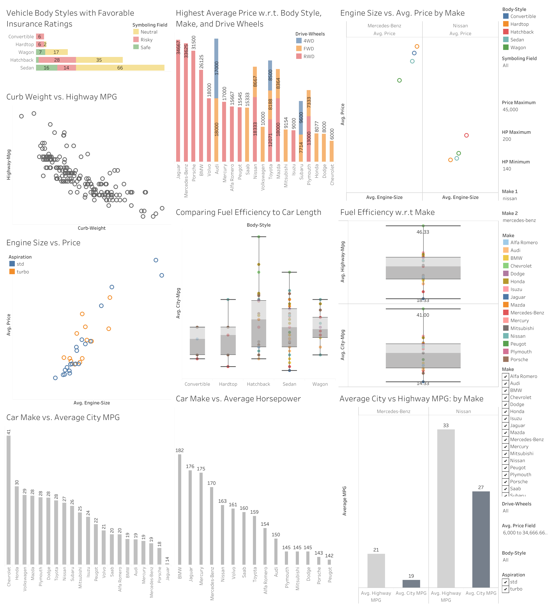

# Car Price Analytics – Tableau Dashboard

Personal data visualization project analyzing car prices and the factors that influence them.

> Click the image to open the interactive Tableau dashboard.

**Use case:**  
Explore how features such as brand, model year, mileage, transmission, and fuel type impact car prices, and help users understand pricing patterns in the used car market.

**Tools used:**  
- Tableau – data visualization & interactive dashboard  
- Python – data cleaning and preparation  
